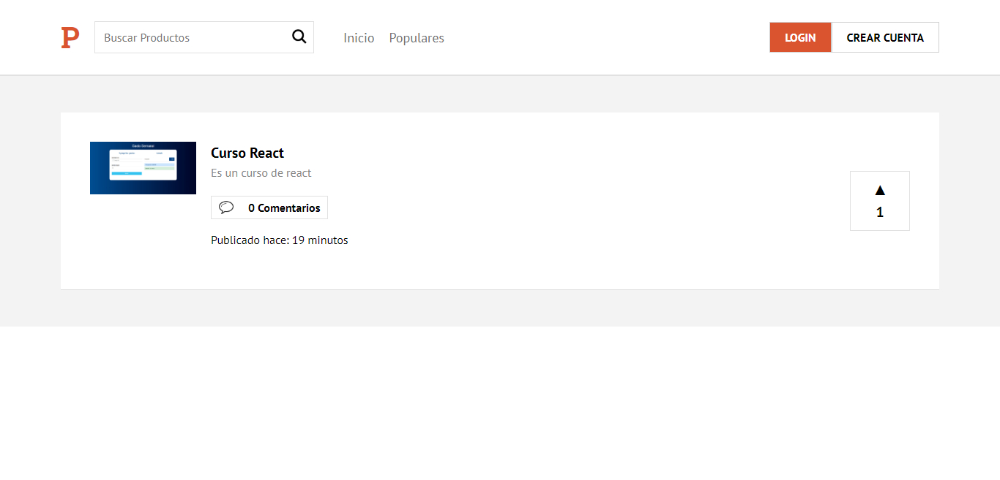

<h1>Product Hunt Clone Application</h1>
<h2>Description</h2>
<p>An application with some functionalities of Product Hunt</p>
<h2>Languages</h2>
<ul>
  <li>HTML</li>
  <li>CSS</li>
  <li>JS</li>
</ul>
<h2>Tools</h2>
<ul>
  <li>React</li>
  <li>Next.js</li>
  <li>Hooks</li>
  <li>Context</li>
  <li>Emotion</li>
  <li>Firebase</li>
</ul>
<h2>Installation</h2>

```
npm install
```

<h2>Run the project</h2>

```
npm run dev
```
<h2>Previews</h2>
Try the live demo https://product-227ee.web.app/


